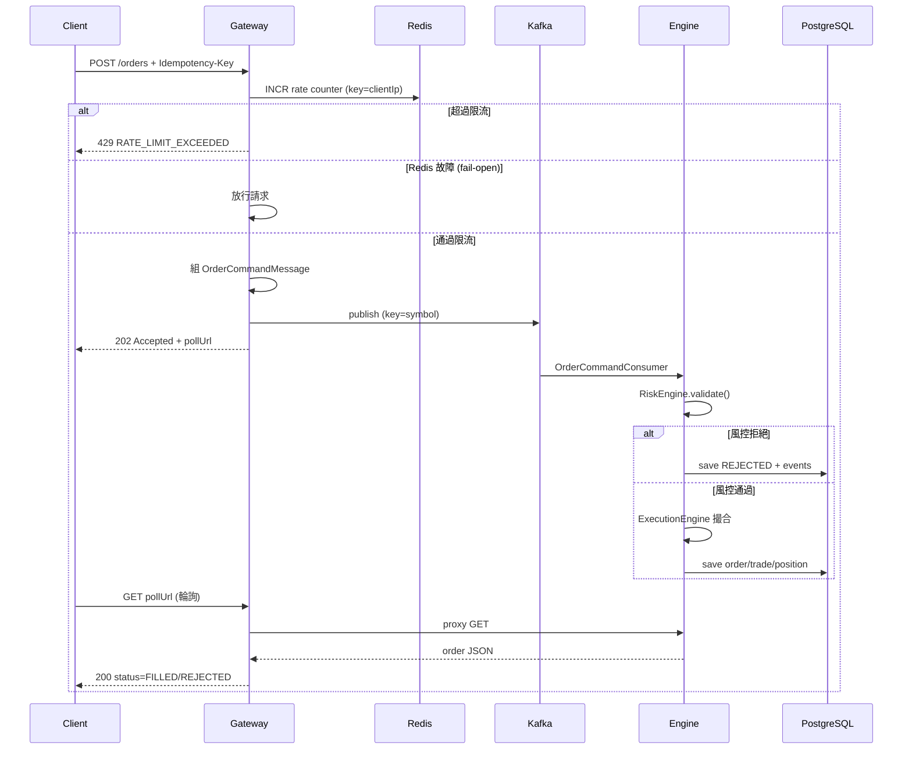
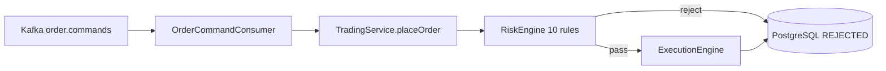
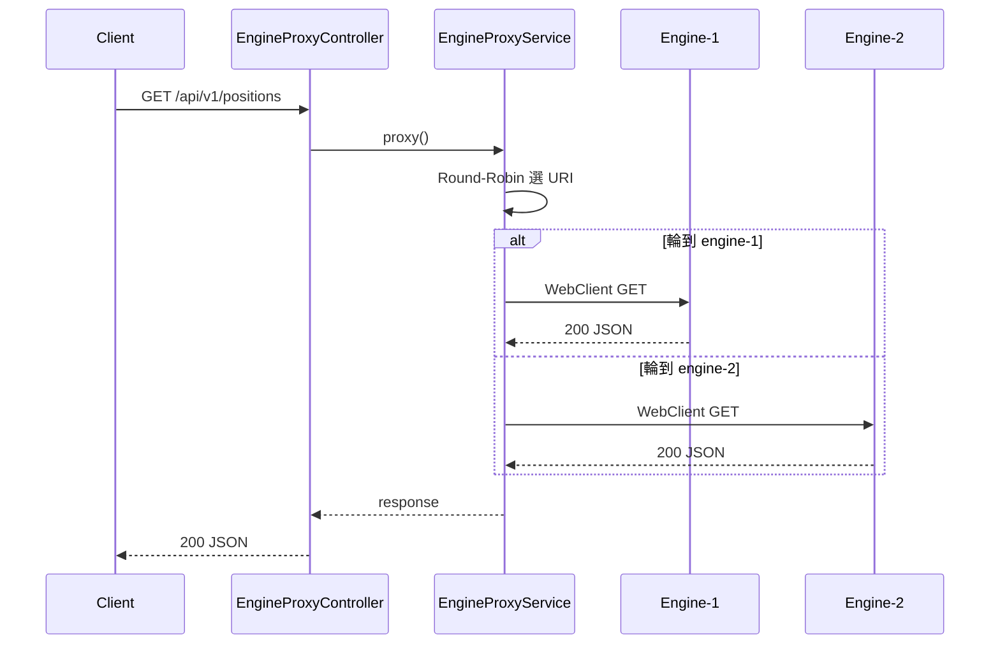
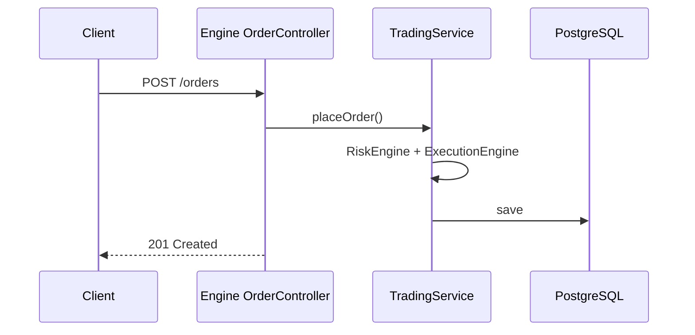

# APIGatewayMQ — 功能流程說明

> 每個 API「做什麼、怎麼跑」。  
> 權威契約以 [`APIGatewayMQ 規格書.md`](../APIGatewayMQ%20規格書.md) 與 [`API規格書.md`](../API規格書.md) 為準。  
> 互動圖請開啟 [`專案引導教學.html`](專案引導教學.html)。

---

## 0. 兩條主路徑

| 路徑 | 寫入 / 讀取 | 技術 | 用途 |
|------|-------------|------|------|
| **寫入** | 下單 | Gateway → Kafka → Engine | 削峰、非同步 |
| **讀取** | 查詢/輪詢/取消 | Gateway → Engine（HTTP 代理） | 即時結果 |

```text
【寫入】Client → RateLimit → OrderSubmitController → Kafka → Consumer → TradingService → DB
【讀取】Client → EngineProxyController → EngineProxyService → Engine API → DB
```

---

## 1. 非同步下單（Gateway 主路徑）

### 端點

`POST http://localhost:8080/api/v1/orders`

### 流程圖



### 逐步說明

| 步驟 | 元件 | 做什麼 |
|------|------|--------|
| 1 | `RateLimitWebFilter` | Redis `INCR gateway:rate:{ip}`；超限回 429 |
| 2 | `OrderSubmitController` | 解析 `Idempotency-Key` → `clientOrderId` |
| 3 | `OrderSubmitController` | 組 `OrderCommandMessage`（含 commandId UUID） |
| 4 | `OrderCommandProducer` | `kafkaTemplate.send("order.commands", symbol, msg)` |
| 5 | Gateway | 回 **202** + `pollUrl`（不等待 Engine） |
| 6 | `OrderCommandConsumer` | `@KafkaListener` 消費訊息 |
| 7 | `TradingService` | `placeOrder(clientOrderId, ...)` 風控+撮合+寫 DB |
| 8 | Client | `GET pollUrl` 輪詢直到終態 |

### 關鍵程式對照

| 步驟 | 類別 | 方法 |
|------|------|------|
| 限流 | `RateLimitWebFilter` | `filter()` |
| 接收 | `OrderSubmitController` | `submitOrder()` |
| 發送 | `OrderCommandProducer` | `publish()` |
| 消費 | `OrderCommandConsumer` | `consume()` |
| 處理 | `TradingService` | `placeOrder()` |

### 為什麼是 202 不是 201？

- **201**：資源已建立（同步，Engine 直連）
- **202**：已接受排隊（Gateway 只保證進 Kafka）

Gateway 不等待風控+撮合+寫 DB，HTTP 連線立即釋放 → **削峰**。

---

## 2. Kafka 消費流程



| 項目 | 值 |
|------|-----|
| Topic | `order.commands` |
| Partition Key | `symbol` |
| Consumer Group | `trading-engine` |
| 多副本 | engine-1、engine-2 同組分攤 |

**冪等保障：**

1. Kafka Producer：`enable.idempotence=true`
2. 業務層：`client_order_id` UNIQUE + `DuplicateCheckRule`（R004）

---

## 3. 查詢 API（Gateway 代理）

### 端點

| Method | 路徑 | 用途 |
|--------|------|------|
| GET | `/api/v1/orders?clientOrderId=` | 輪詢非同步下單結果 |
| GET | `/api/v1/orders/{id}` | 依 ID 查單筆 |
| GET | `/api/v1/orders` | 訂單列表 |
| GET | `/api/v1/positions` | 持倉 |
| GET | `/api/v1/pnl` | 損益 |
| GET | `/api/v1/trades` | 成交紀錄 |
| GET | `/api/v1/orders/{id}/events` | 審計事件 |

### 流程



`EngineProxyService` 依 `gateway.engine-uris`（`ENGINE_URI_1`、`ENGINE_URI_2`）輪詢轉發。

> **注意：** `EngineProxyController` **不代理 POST 下單**，下單只能走 `OrderSubmitController` → Kafka。

---

## 4. 補成交 / 取消（Gateway 代理）

### POST `/api/v1/orders/{id}/fill`

部分成交後手動補足至全量成交。

```text
Client → Gateway → Engine OrderController.fill()
                 → ExecutionEngine
                 → 更新 status → FILLED
                 → 寫 trade + position
```

### PATCH `/api/v1/orders/{id}/cancel`

```text
Client → Gateway → Engine OrderController.cancel()
                 → 驗證狀態（NEW / PARTIALLY_FILLED 可取消）
                 → status → CANCELLED
```

流程與 MVP 相同，差別在請求經 Gateway 代理至 Engine。

---

## 5. 同步下單（Engine 直連，測試用）

`POST http://localhost:8081/api/v1/orders` → **201 Created**



此路徑**不經 Kafka**，用於：

- Engine 單元/整合測試
- 除錯風控規則
- 對照非同步路徑行為

生產環境建議一律走 Gateway 非同步路徑。

---

## 6. 限流流程

```text
每個請求
  → RateLimitWebFilter
  → Redis INCR gateway:rate:{clientIp}
  → count == 1 時 EXPIRE 1 秒
  → count > threshold → 429 + Retry-After: 1
  → Redis 錯誤 → fail-open 放行
```

| 環境 | 閾值 |
|------|------|
| 本機預設 | 50 req/s |
| Docker | 100 req/s（`GATEWAY_RATE_LIMIT`） |

---

## 7. 風控與狀態機

### 風控鏈（Engine 內）

```text
SizeValidation(R003) → DuplicateCheck(R004) → MarketSuitability(R007)
→ TrendConfirmation(R008) → SignalValidation(R009) → VolatilityAdjust(R010, 縮量)
→ PositionLimit(R001) → ExposureLimit(R002) → Volatility(R005) → Overtrading(R006)
```

任一規則拒絕 → `REJECTED` + 422 + `errorCode`。

### 訂單狀態轉換

```text
NEW → PARTIALLY_FILLED → FILLED
  ↓         ↓
REJECTED  CANCELLED
```

| 事件 | 狀態變化 |
|------|----------|
| 風控拒絕 | → REJECTED |
| 全量成交 | NEW → FILLED |
| 大單部分成交 | NEW → PARTIALLY_FILLED → fill → FILLED |
| 取消 | NEW/PARTIALLY_FILLED → CANCELLED |

---

## 8. 錯誤處理摘要

| 情境 | HTTP | errorCode | 發生位置 |
|------|------|-----------|----------|
| 限流 | 429 | `RATE_LIMIT_EXCEEDED` | Gateway |
| Kafka 失敗 | 503 | — | Gateway |
| 欄位驗證 | 400 | `VALIDATION_FAILED` | Gateway / Engine |
| 風控拒絕 | 422 | `RISK_*` | Engine |
| 冪等重複 | 409 | `DUPLICATE_ORDER` | Engine |
| 訂單不存在 | 404 | `ORDER_NOT_FOUND` | Engine |
| 不可取消/補成交 | 422 | `ORDER_NOT_CANCELLABLE` 等 | Engine |

完整 errorCode 表見 [`API規格書.md`](../API規格書.md) §5。

---

## 9. 監控資料流

```text
Gateway / Engine
  → /actuator/prometheus（Micrometer）
  → Prometheus scrape（monitoring/prometheus.yml）
  → Grafana 儀表板
```

壓測時可觀察：HTTP 請求率、Kafka lag、JVM metrics。

---

## 10. 相關文件

| 文件 | 內容 |
|------|------|
| [`專案引導教學.html`](專案引導教學.html) | 互動 Mermaid 圖 |
| [`API規格書.md`](../API規格書.md) | 請求/回應 JSON 範例 |
| [`APIGatewayMQ 架構（Spring Boot）.md`](../APIGatewayMQ%20架構（Spring%20Boot）.md) | 分層與類別索引 |
| [`測試與CI.md`](測試與CI.md) | 各流程對應 Case ID |

---

*最後更新：2026-07-07*
