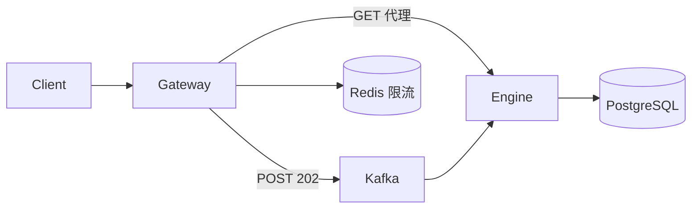

# APIGatewayMQ — 架構學習導引

> **目的：** 把規格書、架構文件、程式碼串成一條可走的路。  
> **適合：** 學完 Trading System MVP 後，進階學習高併發架構。  
> **建議時間：** 3～5 天（每天 1～2 小時）  
> **互動入口：** [`docs/專案引導教學.html`](專案引導教學.html)（Mermaid 架構圖、名詞辭典、類別索引）

---

## 一、先建立「三層理解」

```text
┌─────────────────────────────────────────────────────────┐
│  L1 業務層：這系統在幹嘛？                               │
│      非同步下單 → 限流 → Kafka 削峰 → Engine 處理 → 輪詢  │
├─────────────────────────────────────────────────────────┤
│  L2 架構層：誰負責什麼？                                 │
│      Gateway → Kafka → Engine → PostgreSQL              │
├─────────────────────────────────────────────────────────┤
│  L3 實作層：請求怎麼穿過程式？                           │
│      OrderSubmitController → Producer → Consumer → DB   │
└─────────────────────────────────────────────────────────┘
```

**學習順序：L1 → L2 → L3**

### 與 MVP 的銜接

| 你已經在 MVP 學會的 | 在本專案的新增 |
|--------------------|----------------|
| RiskEngine 10 條規則 | 相同（Engine 模組） |
| 訂單狀態機 | 相同 |
| 201 同步下單 | 改為 202 非同步 + 輪詢 |
| 單體架構 | Gateway + Kafka + 多副本 Engine |
| — | Redis 限流、Prometheus 監控 |

---

## 二、文件地圖

| 階段 | 讀這份 | 解決什麼問題 |
|------|--------|--------------|
| **0. 鳥瞰** | 本文件 §一～§三 | 整體架構 |
| **0.5 圖解** | [`docs/codeGraphic.html`](codeGraphic.html) | 5 分鐘上手（H2）→ 非同步／限流 |
| **1. 能跑** | [`docs/初學者學習說明書.md`](初學者學習說明書.md) | IntelliJ+H2 → Docker → 第一次下單 |
| **1.5 啟動框** | [`docs/啟動與StartupInfoLogger.md`](啟動與StartupInfoLogger.md) | Console 連結怎麼來的 |
| **2. 流程** | [`docs/功能流程說明.md`](功能流程說明.md) | 每個 API 怎麼跑（含 Mermaid） |
| **3. 互動圖** | [`docs/專案引導教學.html`](專案引導教學.html) | 可點選架構圖、名詞辭典、類別表 |
| **4. API 契約** | [`API規格書.md`](../API規格書.md) | 端點、JSON、錯誤碼 |
| **5. 權威規格** | [`APIGatewayMQ 規格書.md`](../APIGatewayMQ%20規格書.md) | 驗收標準、Kafka、測試 DoD |
| **6. 架構哲學** | [`APIGatewayMQ 架構（Spring Boot）.md`](../APIGatewayMQ%20架構（Spring%20Boot）.md) | 為什麼這樣分層、WebFlux vs MVC |
| **7. 測試** | [`docs/測試與CI.md`](測試與CI.md) | Case ID 對照、CI、腳本 |
| **8. 面試** | `卡牌步驟.md` | 四張卡牌口述架構 |

### 文件權威順序

```text
APIGatewayMQ 規格書.md  >  API規格書.md  >  功能流程說明.md  >  架構（Spring Boot）.md  >  README
```

---

## 三、技術架構一頁看懂



### 三模組職責

| 模組 | 職責 | 代表類別 | 技術 |
|------|------|----------|------|
| `common` | Kafka 訊息契約 | `OrderCommandMessage` | Jackson DTO |
| `gateway` | 入口、限流、代理 | `OrderSubmitController` | WebFlux + Redis |
| `engine` | 交易業務 | `OrderCommandConsumer`、`TradingService` | Web MVC + JPA |

### 兩條路徑（面試必答）

| | 寫入（下單） | 讀取（查詢） |
|--|-------------|-------------|
| 路徑 | Gateway → Kafka → Engine | Gateway → Engine（HTTP 代理） |
| 為什麼 | 削峰、非同步 | 即時查結果 |
| 回應 | 202 + pollUrl | 200 |

---

## 四、建議學習路線

### Day 1：能跑起來

| 步驟 | 動作 | 驗收 |
|------|------|------|
| 1 | 讀 [`初學者學習說明書.md`](初學者學習說明書.md) | 理解 202 vs 201 |
| 2 | `.\scripts\start.ps1` | 所有容器 running |
| 3 | Postman 下單 → 輪詢 | status = FILLED |
| 4 | `.\scripts\verify-docker.ps1` | smoke test 通過 |

### Day 2：理解非同步流程

| 步驟 | 動作 | 驗收 |
|------|------|------|
| 1 | 讀 [`功能流程說明.md`](功能流程說明.md) §1 | 能畫 sequence diagram |
| 2 | 開 [`專案引導教學.html`](專案引導教學.html) §3~§4 | 理解 Kafka 契約 |
| 3 | 追蹤 `OrderSubmitController` → `OrderCommandProducer` | 找到 202 回應程式碼 |
| 4 | 追蹤 `OrderCommandConsumer` → `TradingService` | 找到消費入口 |

### Day 3：Kafka + Consumer Group

| 步驟 | 動作 | 驗收 |
|------|------|------|
| 1 | 讀規格書 §5 Kafka | 說出 partition key 為何是 symbol |
| 2 | `docker compose ps` 看 engine-1/2 | 理解 Consumer Group |
| 3 | `gradlew :engine:integrationTest` | ENGINE-MQ-001 全綠 |
| 4 | 讀 [`架構（Spring Boot）.md`](../APIGatewayMQ%20架構（Spring%20Boot）.md) §Kafka | 理解 acks=all |

### Day 4：限流與監控

| 步驟 | 動作 | 驗收 |
|------|------|------|
| 1 | 讀 `RateLimitWebFilter` 原始碼 | 說出 fail-open 策略 |
| 2 | `.\scripts\load-test.ps1` | 觀察 429 出現 |
| 3 | 開 Prometheus `:9090` | 找到 trading-gateway metrics |
| 4 | 開 Grafana `:3000` | 登入成功 |

### Day 5：測試與面試

| 步驟 | 動作 | 驗收 |
|------|------|------|
| 1 | 讀 [`測試與CI.md`](測試與CI.md) | 對照 Case ID |
| 2 | `gradlew check` | 全綠 |
| 3 | 準備 5 分鐘口述 | 見下方「面試題庫」 |
| 4 | 讀 `卡牌步驟.md` | 四張卡牌能脫口說 |

---

## 五、面試題庫（自測）

| 問題 | 參考答案要點 | 文件 |
|------|-------------|------|
| Gateway 為什麼回 202？ | 只保證進 Kafka，削峰釋放連線 | 功能流程說明 §1 |
| 為什麼寫入走 Kafka、讀取走代理？ | 寫入削峰；讀取要即時 | 專案引導教學 §5 |
| partition key 為何用 symbol？ | 同標的順序處理 | 規格書 §5 |
| Consumer Group 如何擴展？ | 加 engine 副本，同 group 分攤 | 架構文件 §Engine |
| Redis 掛了會怎樣？ | fail-open 放行 | 功能流程說明 §6 |
| WebFlux 和 Web MVC 差異？ | 非阻塞 vs 一請求一執行緒 | 架構文件 §WebFlux |
| 冪等如何保障？ | Idempotency-Key + R004 + DB UNIQUE | API規格書 §5 |

---

## 六、程式碼閱讀順序

```text
1. common/OrderCommandMessage.java     ← 訊息長什麼樣
2. gateway/OrderSubmitController.java  ← 202 從哪來
3. gateway/OrderCommandProducer.java ← 怎麼發 Kafka
4. gateway/RateLimitWebFilter.java     ← 限流邏輯
5. gateway/EngineProxyService.java     ← Round-Robin
6. engine/OrderCommandConsumer.java    ← 消費入口
7. engine/TradingService.java          ← 業務核心
8. engine/risk/RiskEngineImpl.java     ← 風控鏈
```

---

## 七、三專案演進（進階）

```text
Trading System MVP     →  學業務與風控（單體）
APIGatewayMQ（本專案）  →  學高併發與 MQ（多模組）
TradingKubernetes      →  學 CI/CD 與 K8s 部署（GitOps）
```

K8s 部署 manifests 見 [`TradingKubernetes`](../TradingKubernetes) 倉庫。

---

*最後更新：2026-07-07 | 搭配 `docs/專案引導教學.html` 互動閱讀*
