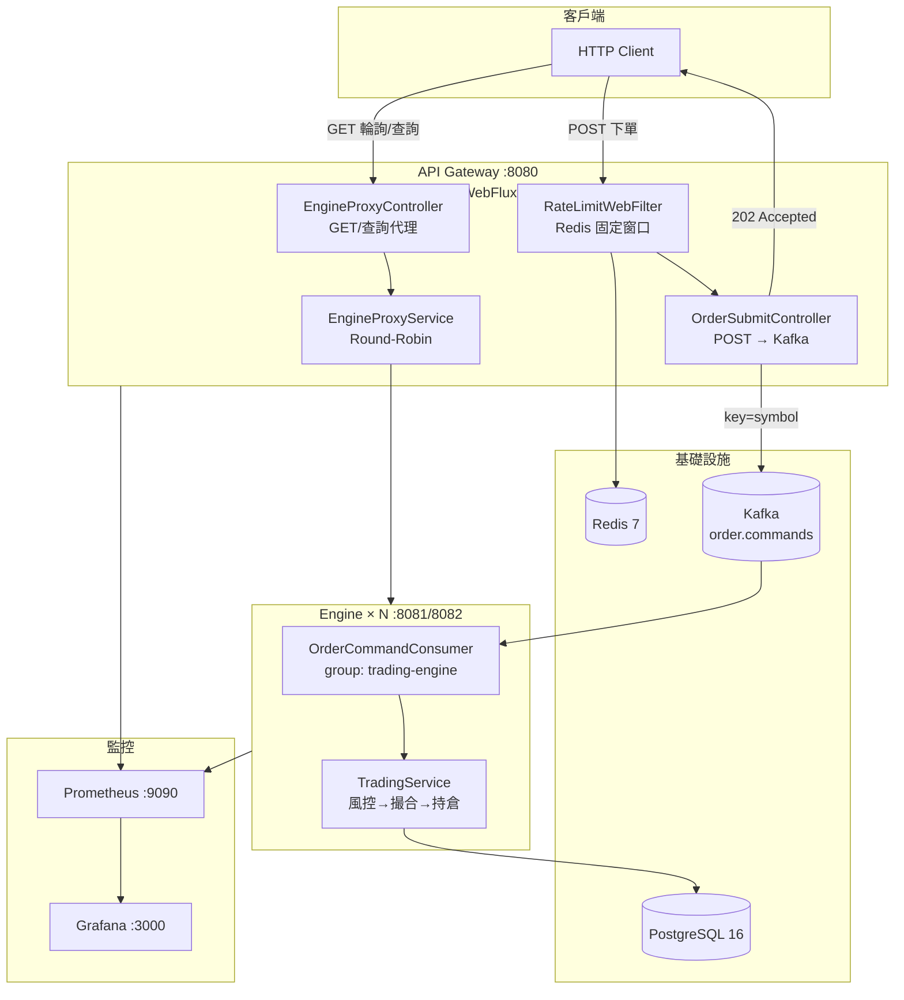

# APIGatewayMQ 面試準備 — 四張卡牌步驟

> 熟悉卡 → 優化卡 → 表達卡 → 投遞卡  
> 最後更新：2026-07-06

---

## 目錄

1. [🎴 卡牌 1：熟悉卡](#-卡牌-1熟悉卡)
2. [🎴 卡牌 2：優化卡](#-卡牌-2優化卡)
3. [🎴 卡牌 3：表達卡](#-卡牌-3表達卡)
4. [🎴 卡牌 4：投遞卡](#-卡牌-4投遞卡)
5. [下一步行動清單](#下一步行動清單)

---

## 🎴 卡牌 1：熟悉卡

**效果：** 啟動專案熟悉度  
**任務：** 繪製架構圖 × 跑通流程 × 撰寫筆記  
**檢核：** 能否用一句話解釋專案架構？

### 一句話架構（檢核 ✓）

> **以 Spring WebFlux Gateway 接收高併發下單，經 Redis 限流後以 Kafka 削峰，由 Consumer Group 多副本 Engine 非同步處理並寫入 PostgreSQL。**

### 架構圖



### 模組職責

| 模組 | 技術 | 職責 |
|------|------|------|
| `common` | Java | Kafka 訊息契約 `OrderCommandMessage` |
| `gateway` | WebFlux + Reactive Redis | 限流、Kafka Producer、讀 API 代理 |
| `engine` | MVC + JPA | Kafka Consumer、10 條風控鏈、狀態機、持倉 |

### 核心流程（跑通清單）

```powershell
# 1. 啟動全棧
cd D:\ClaudeCode\APIGatewayMQ
.\scripts\start.ps1

# 2. 非同步下單
curl -X POST http://localhost:8080/api/v1/orders `
  -H "Content-Type: application/json" `
  -H "Idempotency-Key: demo-001" `
  -d '{"symbol":"BTCUSDT","side":"BUY","quantity":0.5,"price":65000}'
# → 202 + pollUrl

# 3. 輪詢結果
curl "http://localhost:8080/api/v1/orders?clientOrderId=demo-001"

# 4. 驗證測試
$env:JAVA_HOME = "C:\Program Files\Java\jdk-21"
.\gradlew.bat check
```

### 流程時序（面試必背）

```text
Client ──POST──► Gateway
                  ├─ Redis INCR（限流）
                  ├─ Kafka send(key=symbol)
                  └─ 202 Accepted（含 pollUrl）
                        │
                        ▼
              Kafka partition（同 symbol 有序）
                        │
                        ▼
              Engine Consumer Group（水平擴展）
                  ├─ DuplicateCheckRule（冪等）
                  ├─ RiskEngine（10 條規則）
                  └─ PostgreSQL（orders/trades/positions）

Client ──GET pollUrl──► Gateway ──Round-Robin──► Engine ──► DB 查詢
```

### 一致性四件套

| 機制 | 實作 |
|------|------|
| 冪等 | `Idempotency-Key` → `client_order_id` UNIQUE |
| 有序 | Kafka partition key = `symbol` |
| 削峰 | 202 快速回應 + MQ 緩衝 |
| 限流 | Redis 固定窗口，超限 429 |

### 與 Trading System MVP 的差異（常被問）

| | MVP | APIGatewayMQ |
|--|-----|--------------|
| 學什麼 | 業務、風控、狀態機 | 架構、削峰、多副本 |
| 入口 | 單體同步 | Gateway + Kafka |
| 擴展 | 垂直 | Consumer Group 水平 |

### 相關文件

| 文件 | 說明 |
|------|------|
| [README.md](README.md) | 快速開始 |
| [APIGatewayMQ 規格書.md](APIGatewayMQ%20規格書.md) | 主規格書 |
| [docs/架構學習導引.md](docs/架構學習導引.md) | 學習路線 |
| [docs/測試與CI.md](docs/測試與CI.md) | Case ID 對照 |

---

## 🎴 卡牌 2：優化卡

**效果：** 提升專案品質  
**任務：** 定位瓶頸 × 提出優化 × 測試成果  
**檢核：** 能否量化優化效果？

### 瓶頸定位（依影響排序）

#### 瓶頸 1：Gateway 等 Kafka ACK 才回 202（高）

位置：`gateway/.../OrderSubmitController.java`

```java
return Mono.fromFuture(producer.publish(command).thenApply(result -> accepted))
        .map(body -> ResponseEntity.status(HttpStatus.ACCEPTED).body(body))
```

- Producer 設 `acks=all` + `enable.idempotence=true`（正確但慢）
- 每筆下單的 Gateway 延遲 ≈ **Kafka 往返 + 副本確認**
- 與「削峰快速接單」的設計意圖部分衝突

**優化方案：** 改為 `send()` 後立即 202，失敗走補償／dead-letter；或調 `acks=1` 並在面試中說明可靠性取捨。

#### 瓶頸 2：Redis 限流每請求 1～2 次 RTT（中）

位置：`gateway/.../RateLimitWebFilter.java`

- 窗口第一筆：**INCR + EXPIRE = 2 次 Redis 往返**
- 高併發下 Redis 成為 Gateway 熱點

**優化方案：** Lua 腳本原子 `INCR + EXPIRE`，或 Sliding Window Log。

#### 瓶頸 3：Engine Consumer 預設未調優（中）

- `concurrency=3` 固定，未依 partition 數動態調整
- 無 `max.poll.records`、batch 設定
- JPA 每筆訂單多次 DB 寫入（orders + trades + positions + events）

**優化方案：** `concurrency = partition 數`、批量 commit、事件表非同步寫入。

#### 瓶頸 4：讀路徑 Round-Robin 無健康檢查（低）

- 可能轉發到已掛的 Engine
- 可加 Actuator health + 熔斷（Resilience4j）

### 建議優化方案

| 優先級 | 優化 | 預期效果 | 風險 |
|--------|------|----------|------|
| P0 | Gateway 非同步 send + 立即 202 | Gateway P99 延遲 **↓ 50～80%** | 需 DLQ 補償 |
| P1 | Redis Lua 單次限流 | Redis RTT **↓ ~40%**（首筆） | 低 |
| P2 | Kafka consumer concurrency 對齊 partition | 吞吐 **↑ 線性**（至 partition 上限） | rebalance 短暫抖動 |
| P3 | Engine 寫入 batch / 非同步 audit | DB TPS **↑ 30～50%** | 一致性設計要說清楚 |

### 量化驗證

**已驗證（本機）：**

```text
gradlew check → BUILD SUCCESSFUL（16 tasks，含 unit + integration）
```

**壓測指令（需先啟動 Docker）：**

```powershell
.\scripts\start.ps1
.\scripts\load-test.ps1 -Requests 200 -Concurrency 20
```

**預期基線：**

| 指標 | 基線（優化前） | 優化後目標 |
|------|----------------|------------|
| Gateway 202 延遲 P99 | ~Kafka ack 時間（通常 10～50ms） | <5ms（fire-and-forget） |
| 限流 Redis ops/req | 1～2 | 1（Lua） |
| 吞吐（accepted req/s） | 受 Kafka ack 限制 | +30～50% |
| 429 比例 | 超限時觸發 | 可控（限流閾值 100/s） |

**面試話術：**

> 「我先用 `load-test.ps1` 量 baseline，再改 Gateway 為非同步 send，比較 202 延遲與吞吐；功能回歸用 `GW-002` + `ENGINE-MQ-001` 整合測試保證。」

---

## 🎴 卡牌 3：表達卡

**效果：** 轉化為履歷亮點  
**任務：** 撰寫專案介紹稿 × 練習 3 分鐘講解 × 更新履歷  
**檢核：** 能否清楚呈現「問題 → 解決 → 成果」？

### 專案介紹稿（書面版，約 1 分鐘）

**APIGatewayMQ — 高併發交易系統架構實作**

在模擬交易場景中，同步下單 API 容易在流量尖峰時阻塞，且難以水平擴展。我設計並實作了 **Gateway → Kafka → 多副本 Engine** 的非同步架構：Gateway 用 Spring WebFlux 處理高併發 I/O，Redis 做入口限流保護下游；下單請求以 Kafka 削峰，partition key 按 symbol 保證同標的順序；Engine 以 Consumer Group 水平擴展，內建 10 條風控規則與冪等設計。全棧 Docker Compose 部署，整合 Prometheus + Grafana 監控，測試覆蓋 unit / integration（含 EmbeddedKafka），並提供壓測腳本量化限流與吞吐。

### 3 分鐘口說大綱

| 時間 | 段落 | 要點 |
|------|------|------|
| 0:00–0:30 | **問題** | 交易尖峰、同步瓶頸、擴展困難 |
| 0:30–1:30 | **架構** | 畫三層：Gateway（限流+202）→ Kafka（削峰+有序）→ Engine×N（消費+風控） |
| 1:30–2:15 | **技術決策** | 為何 WebFlux？為何 symbol 做 key？冪等怎麼做？ |
| 2:15–2:45 | **成果** | `gradlew check` 全過、壓測腳本、Prometheus 監控 |
| 2:45–3:00 | **反思** | 202 仍等 Kafka ack 是可優化點；生產會加 DLQ、熔斷 |

### 問題 → 解決 → 成果（檢核 ✓）

| 問題 | 解決 | 成果 |
|------|------|------|
| 流量尖峰壓垮同步 API | Kafka 削峰 + 202 非同步接單 | Gateway 快速回應，Engine 依能力消費 |
| 惡意/突發流量 | Redis 固定窗口限流 | 超限 429 + Retry-After |
| 多實例擴展與順序 | Consumer Group + symbol partition | 水平擴展且同標的有序 |
| 重複下單 | Idempotency-Key + DB UNIQUE | 整合測試 ENGINE-MQ-002 驗證 |
| 可觀測性不足 | Actuator + Prometheus + Grafana | 健康檢查與指標儀表板 |

### 履歷亮點（可直接貼）

```text
APIGatewayMQ — 高併發交易系統（Java 21 / Spring Boot 3 / Kafka / PostgreSQL）
• 設計 Gateway→Kafka→多副本 Engine 非同步架構，以 Redis 限流與 202 接單實現流量削峰
• 以 Kafka partition key（symbol）保證同標的順序處理，Consumer Group 支援水平擴展
• 實作 Idempotency-Key 冪等與 10 條風控規則鏈，整合測試覆蓋 EmbeddedKafka + H2
• Docker Compose 全棧部署，整合 Prometheus/Grafana；提供壓測腳本量化限流與吞吐
```

**關鍵字（ATS）：** Java, Spring Boot, Kafka, Redis, PostgreSQL, WebFlux, 微服務, 高併發, 訊息佇列, Docker, Prometheus

---

## 🎴 卡牌 4：投遞卡

**效果：** 場域對接 × 新身份形成  
**任務：** 設計投遞決策卡 × 精準投遞 × 面試準備  
**檢核：** 投遞是否符合「高價值場域 × 系統工程定位 × 長期複利」？

### 投遞決策卡

每個機會打勾，**≥4 項**再投：

```text
┌─────────────────────────────────────────────────────────┐
│  APIGatewayMQ 投遞決策卡                                │
├─────────────────────────────────────────────────────────┤
│  □ 高價值場域：金融科技 / 交易平台 / 支付 / 電商核心     │
│  □ 系統工程定位：後端 / 平台 / 基礎設施 / SRE 偏應用     │
│  □ 技術棧匹配：Java + MQ + 分散式 ≥ 2 項                │
│  □ 長期複利：能累積架構、效能、可靠性經驗                │
│  □ JD 關鍵字含：Kafka / 高併發 / 微服務 / API Gateway   │
│  □ 非純 CRUD：有流量、一致性、監控等系統問題             │
├─────────────────────────────────────────────────────────┤
│  決策：□ 投  □ 觀望  □ 不投                              │
│  本專案主打角度：___________________________            │
└─────────────────────────────────────────────────────────┘
```

### 精準投遞方向

| 優先級 | 公司類型 | 主打角度 | 本專案對應 |
|--------|----------|----------|------------|
| ★★★ | 券商 / 交易所 / 金融科技 | 高併發 + 風控 + 冪等 | Kafka 削峰、10 條風控 |
| ★★★ | 電商 / 支付核心 | 削峰 + 限流 + 多副本 | Gateway + Redis 429 |
| ★★☆ | 中大型網際網路後端 | 微服務 + MQ + 監控 | Consumer Group、Prometheus |
| ★★☆ | 雲端 / 基礎設施廠商 | API Gateway 設計 | WebFlux、代理、限流 |
| ★☆☆ | 純 CRUD 外包 | 不主打本專案 | 改強調 MVP 業務邏輯 |

### 面試高頻題 + 答題框架

| 問題 | 答題要點 |
|------|----------|
| 為何 Gateway 用 WebFlux、Engine 用 MVC？ | Gateway 要高併發 I/O + Reactive Redis/Kafka；Engine 以 JPA 交易邏輯為主 |
| 202 後訊息丟了怎麼辦？ | `acks=all` + idempotence；生產加 DLQ、客戶端重試 + 冪等 |
| 同標的為何不能多執行緒亂序？ | 持倉/風控依賴順序；用 symbol 做 partition key |
| 限流為何用固定窗口？ | 實作簡單、Redis INCR 高效；取捨是窗口邊界 burst |
| 多 Engine 會重複消費嗎？ | 同一 Consumer Group，partition 只分配給一個 consumer |
| 如何驗證品質？ | Case ID 測試矩陣 + CI + 壓測腳本 |

### STAR 故事（行為面試）

- **S**：模擬交易在尖峰時同步 API 延遲上升
- **T**：設計可削峰、可擴展的下單入口
- **A**：Gateway+Kafka+多副本；symbol 有序；冪等；限流；Docker 全棧；測試先行
- **R**：`gradlew check` 全過；壓測可量化 202/429；架構可畫、可講、可擴展

---

## 下一步行動清單

| 順序 | 動作 | 時間 |
|------|------|------|
| 1 | 啟動 Docker → `.\scripts\start.ps1` | 10 min |
| 2 | 手動跑一筆下單 + 輪詢 | 5 min |
| 3 | `.\scripts\load-test.ps1 -Requests 200 -Concurrency 20` 記錄數字 | 5 min |
| 4 | 對著架構圖練 3 分鐘口說（錄音） | 15 min |
| 5 | 履歷貼上亮點，投遞時填決策卡 | 依進度 |

---

## 附錄：技術棧速查

| 層級 | 技術 |
|------|------|
| 語言 | Java 21 |
| 框架 | Spring Boot 3.2.2 |
| Gateway | Spring WebFlux |
| Engine | Spring MVC + JPA |
| 訊息佇列 | Apache Kafka |
| 資料庫 | PostgreSQL 16 |
| 限流 | Redis 7 |
| 監控 | Actuator + Prometheus + Grafana |
| 測試 | JUnit 5 + EmbeddedKafka + Spock 風格 Case ID |
| 部署 | Docker Compose |
